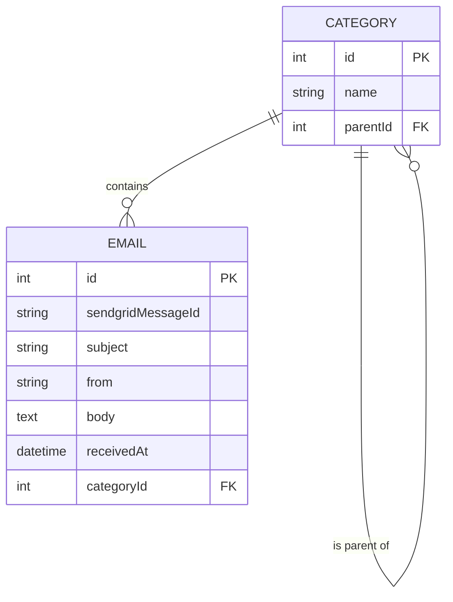

# Data Model for Automated Email Classification

This document defines the data models for the email classification feature, based on the requirements in the feature specification and the decisions made in `research.md`.

## Entity Relationship Diagram (ERD)



## Entities

### Category

Represents a user-defined category for classification. Categories can be hierarchical (up to two levels as per the user's request).

| Attribute  | Type   | Description                                   | Constraints      |
|------------|--------|-----------------------------------------------|------------------|
| `id`       | `Int`  | Unique identifier for the category.           | Primary Key      |
| `name`     | `String` | Name of the category.                         | Required, Unique |
| `parentId` | `Int`  | The ID of the parent category. `NULL` for top-level categories. | Foreign Key (self-referencing) |

### Email

Represents an email received by the system.

| Attribute           | Type       | Description                               | Constraints      |
|---------------------|------------|-------------------------------------------|------------------|
| `id`                | `Int`      | Unique identifier for the email.          | Primary Key      |
| `sendgridMessageId` | `String`   | The unique ID from SendGrid for the email.| Required, Unique |
| `subject`           | `String`   | The subject of the email.                 |                  |
| `from`              | `String`   | The sender of the email.                  | Required         |
| `body`              | `Text`     | The body content of the email.            |                  |
| `receivedAt`        | `DateTime` | Timestamp when the email was received.    | Required         |
| `categoryId`        | `Int`      | The ID of the category this email belongs to. | Foreign Key (Category) |

## Prisma Schema

```prisma
model Category {
  id        Int        @id @default(autoincrement())
  name      String     @unique
  parentId  Int?
  parent    Category?  @relation("SubCategories", fields: [parentId], references: [id])
  children  Category[] @relation("SubCategories")
  emails    Email[]
}

model Email {
  id                Int      @id @default(autoincrement())
  sendgridMessageId String   @unique
  subject           String?
  from              String
  body              String?
  receivedAt        DateTime @default(now())
  categoryId        Int?
  category          Category? @relation(fields: [categoryId], references: [id])
}
```
